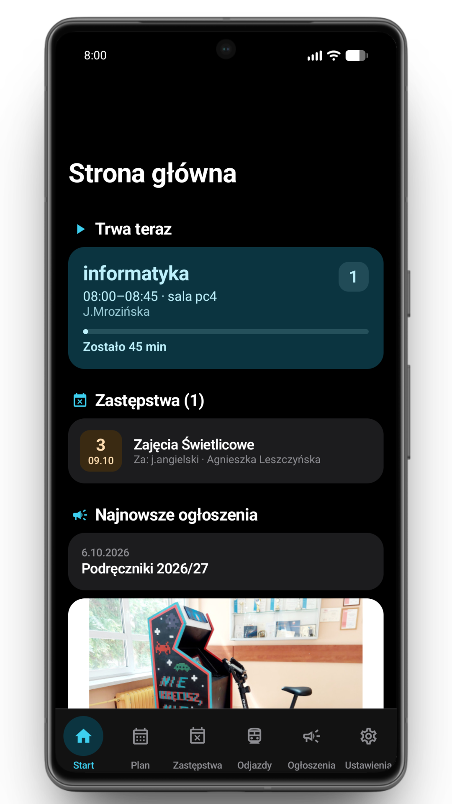
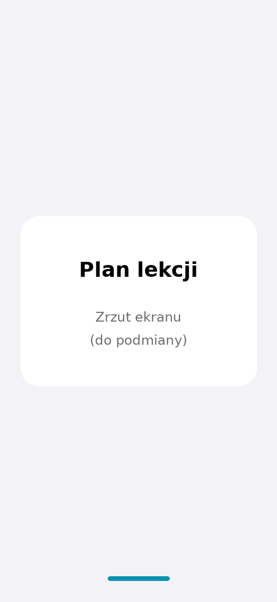
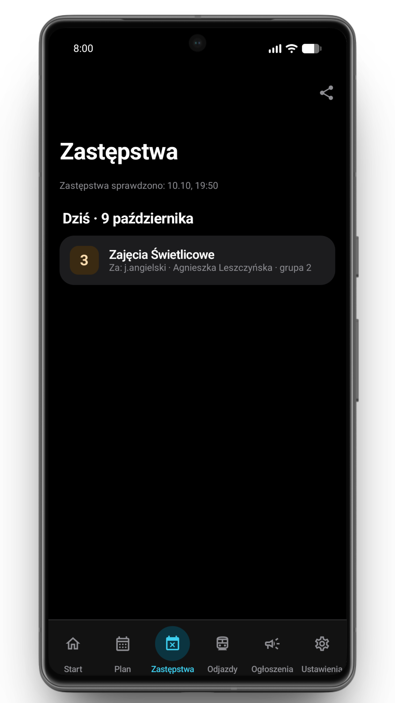
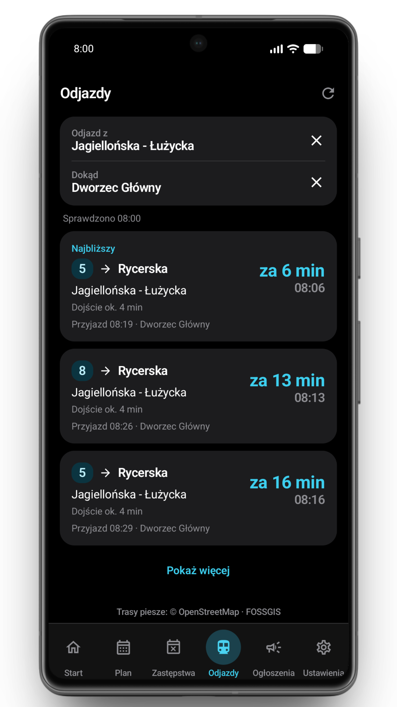
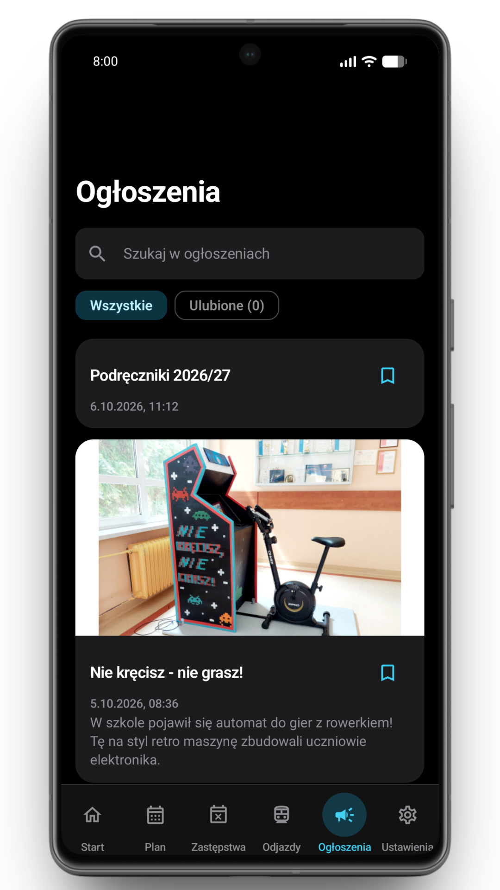
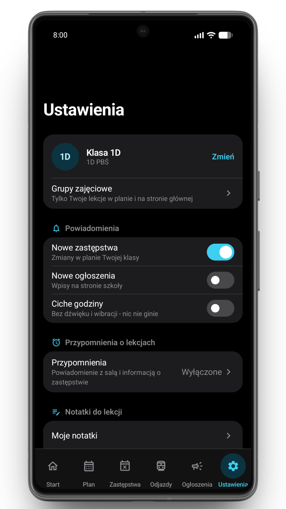
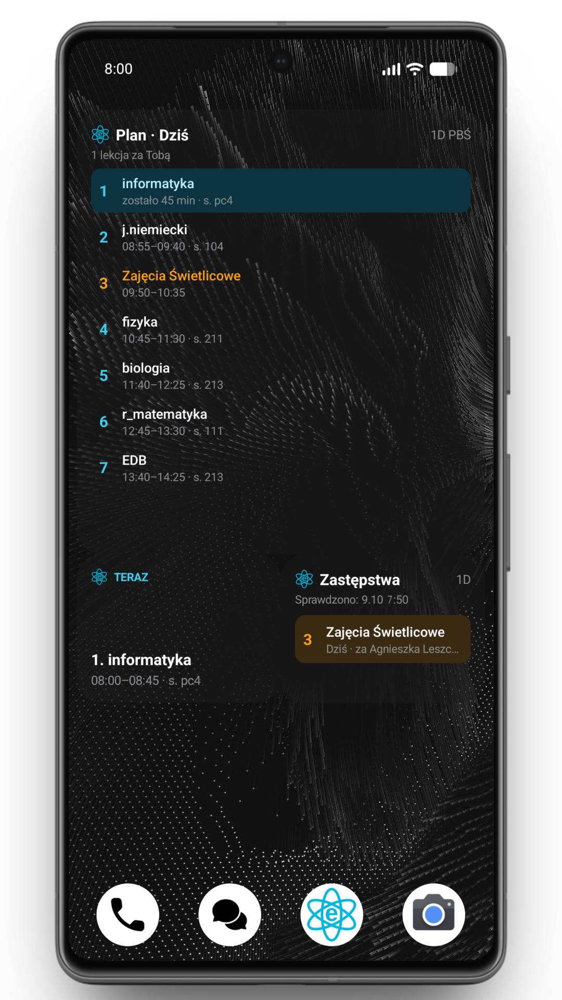
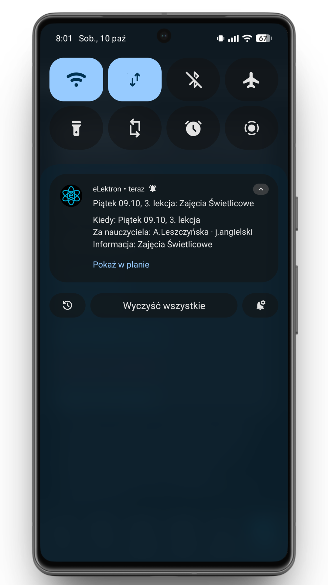

<div align="center">


# eLektron

**Plan lekcji, zastępstwa, ogłoszenia i odjazdy ze szkoły w jednej aplikacji na Androida dla uczniów ZSE w Bydgoszczy.**

[](https://github.com/stasolejnik/elektron/releases)
[](https://github.com/stasolejnik/elektron/actions/workflows/ci.yml)
[](LICENSE)


[**Pobierz aplikację (.apk)**](https://github.com/stasolejnik/elektron/releases/download/v1.0.0/eLektron-1.0.0.apk)

</div>

## O aplikacji

eLektron zbiera informacje potrzebne w szkolnym dniu: plan Twojej klasy i grup, zastępstwa,
ogłoszenia oraz połączenia komunikacji miejskiej ze szkoły. Nie wymaga konta. Pobrane dane
szkolne i zapisane ulubione ogłoszenia można odczytać bez internetu.

To nieoficjalny projekt ucznia, niezwiązany ze szkołą ani z firmą VULCAN. Aplikacja jest
inspirowana [Atomem](https://github.com/kacpergorka/atom) [Kacpra Górki](https://github.com/kacpergorka)
na urządzenia Apple, ale została napisana od podstaw i nie zawiera jego kodu.
Kod tworzą Claude (Anthropic) i ChatGPT (OpenAI); ja wybieram funkcje i testuję aplikację.

## Zrzuty ekranu

<p align="center">
  
  
  
  
</p>
<p align="center">
  
  
  
  
</p>
## Funkcje

- **Plan lekcji:** widok dnia i tygodnia z zastępstwami, szczegóły sali i nauczyciela,
  wybór własnych grup zajęciowych oraz udostępnianie dnia lub tygodnia.
- **Notatki do lekcji:** przytrzymaj przyszłą lekcję, aby dodać notatkę. Możesz ustawić
  przypomnienie przed lekcją albo dzień wcześniej. Notatki są też widoczne w widżetach.
- **Zastępstwa:** zmiany dotyczące Twojej klasy i grup, przejście do lekcji w planie
  oraz udostępnianie pojedynczego zastępstwa lub całej widocznej listy.
- **Ogłoszenia:** wyszukiwanie, czytanie treści w aplikacji i ulubione z zapisem do odczytu
  bez internetu.
- **Odjazdy ze szkoły:** połączenia do wybranego przystanku, linia, kierunek, godziny
  rozkładowe i czas dojścia pieszo. Cel i preferowany przystanek początkowy wybierzesz
  przez wyszukiwarkę lub mapę OpenStreetMap, bez GPS. Dostępne są ostatnie wybory,
  późniejsze odjazdy i opcjonalne połączenia z przesiadką.
- **Strona główna:** trwająca lub najbliższa lekcja, przerwa i nadchodzące zmiany.
- **Powiadomienia:** nowe zastępstwa i ogłoszenia, przypomnienia o lekcjach i notatkach,
  ciche godziny.
- **Szybki dostęp:** widżety Następna lekcja, Plan dnia i Zastępstwa, kafelek szybkich
  ustawień oraz skróty po przytrzymaniu ikony aplikacji.
- **Wygląd:** własne nazwy i kolory przedmiotów, jasny lub ciemny motyw, kolor akcentu,
  kolory z tapety na Androidzie 12 lub nowszym i wybór ikony aplikacji.

Odjazdy są domyślnie wyłączone - włączysz je w **Ustawieniach → Odjazdy** (zakładka i karta
na stronie głównej niezależnie). Punktem początkowym jest szkoła przy **Mieczysława Karłowicza 20
w Bydgoszczy**. Godziny pochodzą z rozkładu, a dojście jest wyznaczane ulicami i ścieżkami.
Sprawdzanie połączeń wymaga internetu; funkcja nie korzysta z lokalizacji telefonu.

## Ustawienia

Sekcje w zakładce **Ustawienia**, w kolejności z aplikacji.

| Sekcja | Co ustawisz |
|---|---|
| **Klasa i grupy** (karta na górze) | Klasa (zmiana wymaga potwierdzenia) i **grupy zajęciowe** - języki, WF, religia i inne podziały. Plan, strona główna, widżety i powiadomienia pokazują wtedy tylko Twoje lekcje. |
| **Powiadomienia** | Nowe zastępstwa i nowe ogłoszenia (ogłoszenia domyślnie wyłączone). **Ciche godziny** - powiadomienia w wybranych godzinach przychodzą bez dźwięku i wibracji, ale nie znikają. |
| **Przypomnienia o lekcjach** | Przypomnienie przed lekcją (domyślnie wyłączone) i ile minut wcześniej. Punktualne przypomnienia wymagają zgody na alarmy o czasie. |
| **Notatki do lekcji** | Lista wszystkich notatek oraz przypomnienia o nich: dzień wcześniej o wybranej godzinie albo kilka minut przed lekcją. |
| **Strona główna** | **Ekran startowy** - co otwiera się po uruchomieniu: automatycznie (w czasie lekcji plan, poza nimi strona główna), strona główna, plan, zastępstwa albo Odjazdy. Karty widoczne na stronie głównej. |
| **Odjazdy** | Zakładka Odjazdy i karta na stronie głównej (niezależne, domyślnie wyłączone), przystanek docelowy („Dokąd”), przystanek początkowy („Odjazd z”) i połączenia z przesiadką. |
| **Wygląd** | Motyw jasny, ciemny albo jak w systemie, kolor akcentu, kolory z tapety (Android 12+) i **ikona aplikacji**: domyślna albo logo na białym tle. Po zmianie ikony aplikacja się zamyka. |
| **Plan lekcji** | Własne nazwy i kolory przedmiotów, pokazywanie sali i nauczyciela. |
| **Pasek nawigacji** | Które zakładki są na dolnym pasku i w jakiej kolejności (przytrzymaj i przeciągnij). |
| **Widżety** | Przezroczystość tła oraz sala i nauczyciel w widżetach. W motywie Auto przy dużej przezroczystości kolor tekstu dopasowuje się do tapety. |
| **Działanie w tle** | Stan optymalizacji baterii i poradnik dla Twojego telefonu - przydatne, gdy powiadomienia lub widżety się spóźniają. |
| **Aktualizacje** | Wersja z GitHuba: **kanał** „Stabilne” (domyślnie) albo „Beta” (także wersje testowe) i ręczne sprawdzenie aktualizacji. |
| **Dane** | Wyczyszczenie danych podręcznych - plan, zastępstwa i ogłoszenia pobiorą się od nowa; ustawienia, notatki i ulubione zostają. |
| **O aplikacji** | Wersja, zgłaszanie problemów z raportem, kontakt, kod źródłowy i polityka prywatności. |

Skróty po przytrzymaniu ikony aplikacji: Plan lekcji, Zastępstwa, Ogłoszenia, Strona główna
i - przy włączonej zakładce - Odjazdy.

## Instalacja i aktualizacje

1. Pobierz [**eLektron-1.0.0.apk**](https://github.com/stasolejnik/elektron/releases/download/v1.0.0/eLektron-1.0.0.apk) (wszystkie wersje: [wydania na GitHubie](https://github.com/stasolejnik/elektron/releases)).
2. Otwórz pobrany plik na telefonie.
3. Jeśli Android poprosi o zgodę na instalację z przeglądarki lub menedżera plików,
   zezwól na instalowanie z tego źródła.
4. Przy pierwszym uruchomieniu wybierz klasę i swoje grupy zajęciowe.

Aplikacja wymaga **Androida 8.0 lub nowszego**. Kolejne wersje instaluj jako aktualizację,
bez odinstalowywania - zachowasz ustawienia, notatki i ulubione. W wydaniu z GitHuba
aktualizacje można sprawdzić również w aplikacji, w **Ustawieniach → Aktualizacje**
(domyślnie tylko wersje stabilne; kanał „Beta” obejmuje też wersje testowe).

## Powiadomienia

Android może opóźniać pracę aplikacji w tle. Jeśli powiadomienia nie przychodzą,
sprawdź zgodę na powiadomienia oraz sekcję **Działanie w tle** w Ustawieniach eLektronu.
Przypomnienia o lekcjach korzystają także z uprawnienia do dokładnych alarmów.

Dane szkolne są sprawdzane w tle przez WorkManager; wariant z GitHuba korzysta również
z powiadomień Firebase Cloud Messaging. Informacje o zastępstwach i ogłoszeniach pochodzą
ze stron szkoły. Odjazdy są sprawdzane podczas korzystania z tej funkcji.

## Prywatność

Aplikacja nie wymaga konta i nie zawiera reklam ani analityki. Ustawienia, notatki i ostatnie
wybrane przystanki są przechowywane lokalnie. Odjazdy nie wymagają GPS: zapytania dotyczą
stałego adresu szkoły i wybranych przystanków. Mapy i wyznaczanie tras korzystają z usług
zewnętrznych. Wariant `gms` korzysta również z Firebase do powiadomień i GitHuba do aktualizacji.
Szczegóły połączeń, przechowywania danych i kopii zapasowych: [PRYWATNOSC.md](PRYWATNOSC.md).

## Zgłaszanie problemów

W Ustawieniach użyj **Zgłoś problem**, aby przygotować raport z wersją aplikacji, informacjami
o urządzeniu i ostatnimi logami. Po awarii aplikacja może zaproponować raport przy kolejnym
uruchomieniu. Raport wysyłasz samodzielnie.

Opisz, co się stało i jak odtworzyć problem, w [Issues](https://github.com/stasolejnik/elektron/issues)
lub napisz na [kontakt.elektron@pm.me](mailto:kontakt.elektron@pm.me).

## Dla osób rozwijających projekt

Kotlin, Jetpack Compose, Material 3, Hilt, Room, DataStore, WorkManager, Glance,
OkHttp, Jsoup i osmdroid. Wymagania: JDK 17 i Android SDK; minSdk 26.

| Wariant | Zawartość |
|---|---|
| `gms` | GitHub Releases, powiadomienia FCM i aktualizacje w aplikacji |
| `foss` | Wolne zależności, bez usług Google i instalowania aktualizacji z aplikacji |

Testy i kompilacja wariantu `foss`:

```sh
./gradlew :app:testFossDebugUnitTest :app:assembleFossDebug
```

Wariant `gms` wymaga lokalnego `app/google-services.json`; konfigurację opisuje
[PORADNIK_PUSH.md](PORADNIK_PUSH.md). Podpisywanie wydań wymaga `keystore.properties`
([przykład](keystore.properties.example)). Pliki konfiguracji i klucze nie trafiają do repozytorium.

Kod wspólny jest w `app/src/main/`, a zależny od wariantu w `app/src/gms/` i `app/src/foss/`.
Historia wydań: [CHANGELOG.md](CHANGELOG.md).

## Źródła danych

| Dane | Źródło |
|---|---|
| Plan lekcji i lista klas | [plan.zse.bydgoszcz.pl](https://plan.zse.bydgoszcz.pl) |
| Zastępstwa | [zastepstwa.zse.bydgoszcz.pl](https://zastepstwa.zse.bydgoszcz.pl) |
| Ogłoszenia | [zse.bydgoszcz.pl](https://zse.bydgoszcz.pl) |
| Przystanki i połączenia | [BUSearch Bydgoszcz](https://busearch.pl/bydgoszcz) |
| Mapa | [OpenStreetMap](https://www.openstreetmap.org/copyright) |
| Trasy piesze | [FOSSGIS / OpenStreetMap](https://routing.openstreetmap.de/about.html) |

## Licencja

Copyright © 2026 Stanisław Olejnik.

eLektron jest wolnym oprogramowaniem na licencji [GNU GPL](LICENSE) w wersji 3 lub
późniejszej. Podziękowania i informacje o zależnościach: [NOTICE](NOTICE).
